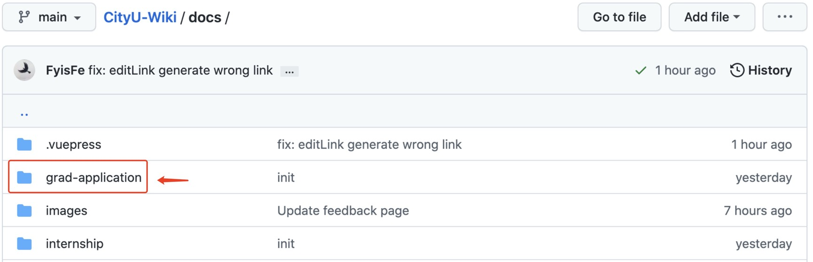
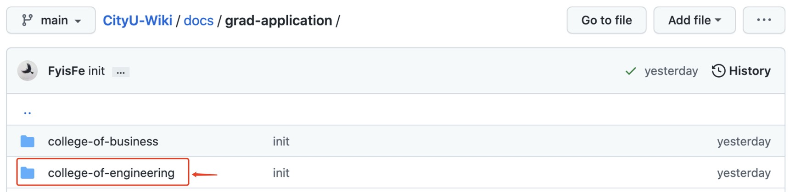
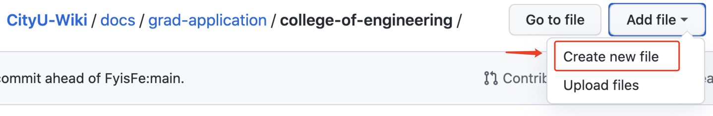
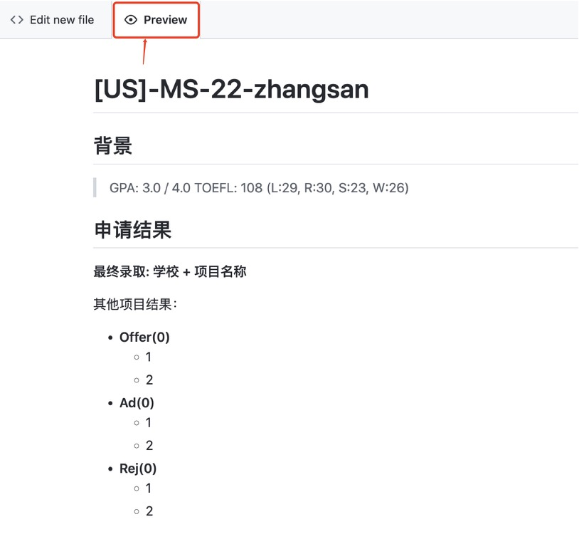
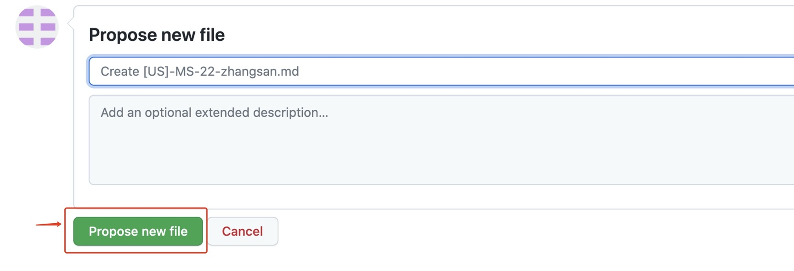
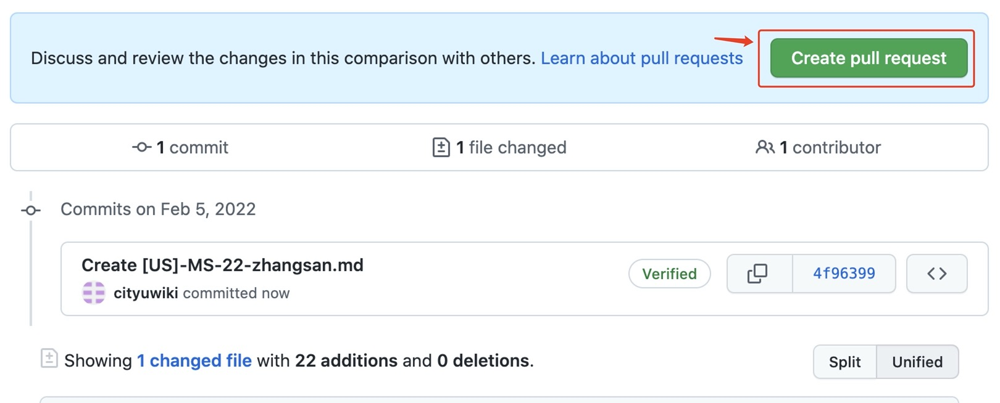
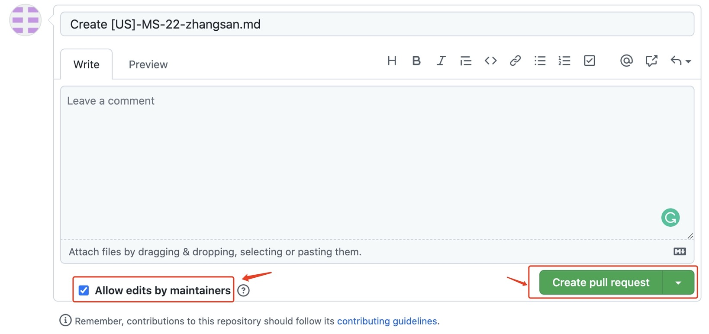
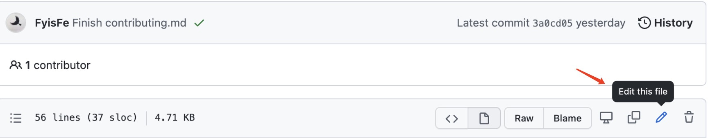

# 贡献指南

我们提供了一下四种贡献方式，请根据自身需求进行选择。感谢你愿意分享自己宝贵的经历！祝大家前程似锦！

:::tip
**请不要过分在意文章的质量（~~当然还是得稍微在意一下~~）与长度。哪怕是您的一点随笔都是后人的宝贵财富！**
:::

## 使用 Google Form <Badge type="tip" text="Easy" vertical="top" />

通过[此表单](https://forms.gle/6KzthXnnAgh3Ckx98)，因为目前处于初级阶段，且 Google Form 较为死板，我们有很大可能**考虑不周**。如对表单内容有所建议，请及时[联系我们](./feedback.md)，我们会尽快改善。

## 使用 Email <Badge type="tip" text="Easy" vertical="top" />

对于没有 Git, GitHub 使用背景的同学：请将编辑好的`Word/Pages`文件发送到**cityuwiki AT 寄 mail DOT com**(~~不想被爬, 相信大家看得懂！~~), 并附上合适的标题，我们会帮助您把文章上线。

- 请注明您的文章想发表的位置。
- 如果想发表到新的类别，请在邮件中提出。
- 请附上**经历发生的时间,姓名（或模糊化的名字）,经历名称**。例如,`2022-不愿意透露姓名的张三-PwC`。

## 使用 GitHub 网站进行贡献 <Badge type="warning" text="Medium" vertical="top" />

首先请我们代表学弟学妹们，感谢你愿意分享自己宝贵的经历，同时我们也要感谢你选择了自食其力的方式，这为我们节省了大量格式转换的时间，现在我们只需专注于修改、审核即可。同时我们要恭喜你拥有了自己的 `Github` 账号并且了解了`.md` 也就是 `Markdown` 这种神奇的事物。希望这个账号不会就此荒废，因为 `Github` 是这个世界上最富饶的代码库，你几乎可以找到任何你想要的东西; `.md`也是在我看来不亚于`LaTeX`的优雅记录笔记的方式。

最后，再次祝前程似锦。

您可以使用 [GitHub](https://github.com) 网站进行贡献，本质上就像在贴吧/城墙发贴。

:::warning
或许对大多数没有变成经验的同学有些困难，但是我们会尽可能地帮助您。**当然您也可以使用以上两种方式进行贡献**:tada:。
:::

### 登陆

**如果已有`GitHub`账号可跳过此步**。打开[GitHub](https://github.com/), 点击`Sign Up`按钮注册一个`Github`账号，选择`Free Plan`即可。

### 访问目标文件夹

项目大致的文件结构请看[这里](#项目结构)。

登陆后进入[这个页面](https://github.com/FyisFe/CityU-Wiki/tree/main/docs)，打开一个你想要分享的页面，比如`个人申请总结` => `工学院`。



### 创建新文件

点击`Create New File`。


### 开始编写

1.  命名方式为`[US]-MS-22-zhangsan.md` 即为工学院，22 年申请到美国 Master 项目的 zhangsan 的经验分享。**请包含后缀名**。
2.  在文件中写入你的经验分享 (Markdown)。

    1. **如果您不会使用 `Markdown`，可以参考[这个页面](https://www.runoob.com/markdown/md-tutorial.html)。**
    2. **当然，您也可以直接像使用`txt`文件一样来进行编写，我们会进行后续的格式整理。**
       :::tip
       请在段落间使用空行分割，并在标题上使用`#`标记。

       ```md
       # 一级标题

       段落 1

       ## 二级标题

       段落 2
       ```

       :::

3.  以下为一个简易模板，**您也可以借鉴已有文件的内容**

```md
# [US]-MS-22-zhangsan

## 背景

> GPA: 3.0 / 4.0
> TOEFL: 108 (L:29, R:30, S:23, W:26)

## 申请结果

**最终录取: 学校 + 项目名称**

其他项目结果：

- **Offer(0)**
  - 1
  - 2
- **Ad(0)**
  - 1
  - 2
- **Rej(0)**
  - 1
  - 2
```

您可以在`preview`中查看生成结果:


### 提交 Pull Request

1. 点击`Propose new file`。
   

2. 点击`Create pull request`。
   

3. 请在确保`Allow edits from maintainers`是被选中状态，这样我们可以帮助你解决一些琐碎工作。点击 `Create pull request` 按钮。
   

### 编辑文件

:::tip
如果您想对任何页面进行编辑，请在`GitHub`找到相应的文件并点击`Edit this file`进行修改，或直接在`CityU Wiki`网站中点击`Edit this page`，之后的步骤与以上完全相同。

:::

## 本地贡献 <Badge type="danger" text="Advanced" vertical="top" />

**Love u guys!**

1. Fork this Project.
2. Make sure you have [Node.js v12+](https://nodejs.org/en/)
3. `git clone forked-repo`

Then you can run this project by:
<CodeGroup>
<CodeGroupItem title="YARN">

```bash:no-line-numbers
yarn install
yarn docs:dev
```

</CodeGroupItem>

  <CodeGroupItem title="NPM" active>

```bash:no-line-numbers
npm install
npm run docs:dev
```

  </CodeGroupItem>
</CodeGroup>

### 项目结构

所有的核心代码均在`docs`文件夹下。以下为部分核心文件结构：

```sh
├── .vuepress
│   ├── config.js # 配置文件
│   ├── configs # 配置目录
│   │   ├── sidebar.js # 侧边栏配置
│   │   └── navbar.js # 导航栏配置
├── grad-application # 个人申请总结
│   ├── College of Engineering # 工学院
│   │   ├── README.md # 目录
│   │   └── [US]-MS-22-zhangsan.md # 工学院，22年申请到美国Master项目的zhangsan的经验分享
├── internship
│   ├── campus # 校内实习
│   │   ├── README.md # 目录
│   │   └── [CS]-22-zhangsan.md # 22年校内CS Depart实习的zhangsan的经验分享
│   ├── it # 互联网实习
│   │   ├── README.md # 目录
│   │   └──[Google]-22-zhangsan.md # 22年Google实习的zhangsan的经验分享

```

This project is built with [vuepress](https://v2.vuepress.vuejs.org/) under the hood.
