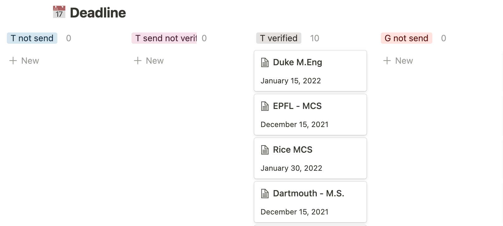

# CMU MS-SE-SV

> Author: FENG Yi
>
> Email: fy552005184 [AT] gmail [DOT] com

## 基本背景

### 标化

- **Major**: CS
- **GPA**: 3.97/4.3 (申请时)
- **TOEFL**: 108 (R: 30, L: 29, S: 23, W: 26)
- **GRE**: 320 (Q: 168, V: 152, AW: 3.5)

### 软背景

- **Internship**: Placement 跟着 Dr. Li Shuaicheng 做了 9 个月，3 个月 [Google Summer of Code](https://summerofcode.withgoogle.com/)。
- **Research**: 3 段。 和 Prof. Li Minming 做的 RMS，算法相关。大三的时候在 Minming 的推荐下和两名国外的教授做了一段 k-submodular 的 research。 Placement 应该也算一段，全都没发 Paper。
- **Reference Letter**: 来自于上面提到的两位本校的教授，和合作的英国教授(King's College London)。应该 2-3 封强推。
- **Competition**: Placement 的时候混过几个互联网+的奖，最好的是银奖，probably 没啥用。
- **Scholarship**: 无。

## 申请结果

### AD(6)

| 学校          | 项目                       | 提交时间       | 通知时间       |
| :------------ | :------------------------- | :------------- | -------------- |
| **Brown**     | **CS-ScM**                 | **2022/02/01** | **2022/03/19** |
| **CMU**       | **MSSE-SV**                | **2021/12/13** | **2022/03/16** |
| **UCI**       | **MCS**                    | **2021/12/16** | **2022/03/11** |
| **USC**       | **MSCS (CS28)**            | **2021/12/14** | **2022/03/04** |
| **Dartmouth** | **MSCS (50% Scholarship)** | **2021/12/16** | **2022/02/19** |
| **Rice**      | **MCS**                    | **2021/01/31** | **2022/02/18** |

### REJ(7)

| 学校       | 项目                        | 提交时间       | 通知时间       |
| :--------- | :-------------------------- | :------------- | -------------- |
| **HKU**    | **MSc-financial computing** | **2021/12/31** | **没信**       |
| **UCB**    | **MENG**                    | **2022/01/06** | **2022/04/22** |
| **UCSD**   | **MSCS CS75**               | **2021/12/13** | **2022/03/29** |
| **EPFL**   | **MSCS**                    | **2021/12/14** | **2022/03/17** |
| **Purdue** | **MSCS**                    | **2021/12/21** | **2022/03/11** |
| **CMU**    | **MSIN**                    | **2021/12/01** | **2022/03/02** |
| **ETHz**   | **MSCS**                    | **2021/12/14** | **2022/02/25** |

### Withdraw(2)

- **HKUST PhD** - 参与了提前批面试，Prof 先把我拒绝了，之后问我愿不愿意去南方科技大和另一个教授双 Supervisor，最后拿 UST 的毕业证。一个是听起来不太靠谱，另外是我决定不搞科研了就拒了。
- **Duke ECE** - 太贵了，直接没交。

## 申请经验&感受：

今年 DIY 的申请结果已经远远的超出我的心理预期了，完全没想到今年的申请形式会这么好，可能是不少学校都在扩张，唯一后悔的就是彩票抽的太少了有些遗憾。

个人感觉中介没啥必要，自己的未来只有自己才会上心。考 GT 的资料网上自己也能找的差不多，那些花钱的实习科研感觉也完全没自己找的靠谱。选校之类的其实还是靠自己，查资料的时候也能对项目多了解不少，文书写起来更方便。 况且中介有时候也会有反作用，比如有个中介把 Prof 的 title 填错了，或者个人信息填错了，花钱还不安心，不如自己来。

### 1. GT

G 刷到 325，T 刷到 105（22）应该就绰绰有余了。 **十分建议大家早早准备，越早拿到手越安稳**，毕竟 T 有 2 年有效期，G 有 5 年。

我没把 T 当回事，导致考了很多次到 10 月 23 才考出来，外加 G 也赶到了一起。申请时候还有一篇 paper 在赶 ddl，压力相当大。 经验帖可以看看我写的这篇[《N 战 TOEFL 经验总结》](../../language/toefl/[CS]-2018-fengyi.md)。

G 考的太烂了我也不分享啥了，只能说尽量早准备，战线拉太长会很疲，然后脱产大概三周到一个月时间应该很够。 今年还是很多学校免了 G，我也算沾了光，但之后 G 会不会继续免也是未知数，大家还是早早准备，我也因为 G 不够很多学校没有尝试。

### 2. GPA

GPA 在 Master 项目的申请里还是个相当重要的硬性指标，大家能刷多高还是刷多高。 可以多选一些专业课，CS 的大部分课给分都相当好。CCIV，一区 GE 等给分差的课，尽量还是放在 yr4 上，毕竟拿个 A-可能都会把 GPA 拉低。

Rank 的话可以去 CS Depart 问， 但是现在只会给一个模糊的指标（如 5%和 10%），不会出具 official 的 proof，所以没啥用。

### 3. 选校

还是先确立自己的目标，看看自己是想留港还是回内地，是去美国找工还是做 research，然后再根据自己的目标去选项目。

我的目标就是去美国找工，完全不考虑读博（太 struggle 了，最后一段做的有点 PTSD，我会考虑回老家种地也不会考虑读博），所以申的基本全是美国的项目。

- **HKU**: 是为了保底，赶着第一轮最后一天交的，事实证明完全没必要（最后被默拒了是最魔幻的，所以大家要是想留港还是早申请，晚了名额就没了）。

- **ETH, EPFL**: 也算是 CS 传统艺能了，现在想想既然不考虑读博，也完全没必要申这两个（虽然都是 Reject）。 ETH 是标化控，感觉今年 GPA 卡了 4.0. 另外要注意的一点就是 ETH 需要提交高中毕业证，想申请的话提早准备下。

- **加拿大**: 基本都是 research 的项目，只有 UoT 的 MScAC 是个找工项目但我 GRE 不够，所以没申请加拿大的项目。 据说其他项目一定要套瓷，不然就是捐钱。

- **美国**： 这些项目基本都是看往届飞跃手册选的。但是有个弊端就是可能会忽略很多还挺好的学校，比如 UCD，另外就是会加剧内卷。 我和王开鹏都有一些只有自己申了的项目，结果还都不错。 所以鼓励大家自己多去调查调查学校。

另外推荐大家的选校最好是别怂，保底太多了也没用有点像捐钱。 而且有些项目的 bar 并没有低，比如 CMU 的 MSIN，当时是觉得申不到本部的 CS 项目就选了这个，事实上这个项目的 bar 已经比较高了，看今年不少拿到 MCDS 和 MSCS AD 的被这个项目 WL 或者 REJ 了。

### 4. 推荐信

个人感觉作为一个早早就决定放弃读博的人来说，推荐信是个挺无语的事情。 基本所有项目都是要 academic reference letter，导致必须要去做 research 才能拿到比较 strong 的推荐信，耽误学技术的时间，还很 struggle。

research 的话可以参与下 RMS，两个朋友 RMS 跟着 minming 发了共一。我虽然 RMS 没 publication，但是 minming 也帮我认识了两位国外老师做了一段，获得了一封比较 diverse 的推荐信。

建议大家早点和 prof 确认他会给你写，并找 3 到 4 个 prof 写推荐信，提前预防下意外情况，催 prof 交推荐信基本是个不可避免的情况。 说到这里真的感谢十分感谢 minming，推荐信秒交，而且人特别好，真的把我的背景提升了好几个档次。

### 5. CV & SOP

首先推荐两个软件，第一个是 Grammarly（学校也给了大家 Premium 就不细说了）。 另一个是[Wordtune](https://www.wordtune.com/)，可以帮你改写句子，感觉这个改写的挺流畅的就买了 Premium，一个月 100 多物有所值。

这两个用完了**一定要检查**，有概率把句意改的不对。

:::warning

- 一定要去调查项目的官网要求，如果格式什么的不符合要求，很可能直接进垃圾桶了。
- 还是翻项目官网，全方位的了解项目和学校，写 essay 的时候能得心应手一些。
- 早动手
  - 有的项目不只要一篇 SOP/PS， 还要 PHS 或者交 Sample Code 等
  - 有时间让朋友/中介 review 和自己修改
  - 要多改几版才能找到自己最舒服的写法
- 多让仔细的朋友检查检查
  :::

#### CV

推荐用 LaTeX，网上模板比较多，找一个看起来学术一些的就好。尽量压缩到一页， 但不要太挤，字体不要小于 11pt。 记得去**调查一下项目官网**看看 CV 有什么要求，比如 CMU 有 instruction，里面有不少要求，像 work experience 要写地点。所以不要一份 CV 给所有项目用，而且学术型项目和找工类项目的 CV 侧重点也肯定不同。

**写完了一定要仔细检查并且 Peer Review。** 我当时就把 Silver Prize 打成了 Sliver Prize，都是正常单词 Grammarly 也查不出来，又因为我复制粘贴，基本网申的表和 CV 里面都是错的。

#### SOP

有的学校（比如 UCB，Dartmouth）会要 Personal History Statement/Diversity Statement，写的时候区分一下。 然后 Personal Statement 和 SOP 感觉区别不大，如果项目两者都要，我就把 PS 当 PHS 写的。**强烈建议去调查项目官网的要求**（字数，结构，格式等），针对性的修改。

我没有找中介修改，感觉 Wordtune 改的挺不错的，最好再找 native speaker 改改。看往届学长姐有推荐芝士圈，我没试过就不评价了。建议大家早一点写个初版，在 10 月份左右开始动手时间应该够。

SOP 怎么写还是见仁见智，适合自己的最重要，但一定要体现出和项目的契合度。如果你申请一个科研型的项目，文书却全写的找工，自然而然很难被录取。 我的结构仅供大家借鉴一下：

- 引入（很短）： CMU 明确写了不要讲故事，所以一定要看官网修改
- 学术背景（GPA 很高，基础很牢，blabla）
- 工作经历
- 研究经历
- 以后的计划与目标
- Why School（吹一吹怎么和目标符合）
- Conclusion

主要是把故事讲的 coherent 一些，以我申请 Software Engineering 的项目为例。

::: details

- 引入简单写对做 SDE 兴趣很大，想做什么什么为世界做贡献（简单吹一下牛）。
- 介绍了下自己在本科学了某些课（可以看官网写的要求，比如侧重 system，就写你上过 OS），而且 GPA 很高 blabla。
- 介绍工作经历，在工作中学到了些什么，有哪些成果，更加坚定了目标。
- 这个项目没必要写研究经历，如果工作经历不足的话，可以找角度往项目上凑。 比如做过算法的 research，最后总结的时候就可以写你学到了 time/space complexity 的重要性，让你在写代码的时候使用合适的 data structure，写出更 clean 和 efficient 的 code。
- 以后想去硅谷当程序员，然后简单说一下自己短期和长期的计划。
- 这个项目完美契合我的目标和计划
  - 课程
  - 地理位置
  - career service
- 结论

:::

一开始写起来是挺 struggle 的，但改了几版之后就好很多了，有个科研版和一个找工版，剩下的基本只需要改一下 why school 就够了。

### 6. Video Essay

感觉是在 GRE 重要性下降之后，推出的新的评测指标。 主要有以下两种：

- 问题提前告诉你，录视频提交 （这种可以稍微剪辑下，加个字幕/图片等，显得重视）
- 像 TOEFL 听力，随机出个题，几十秒准备，直接作答 3 分钟。

提前去一亩三分地搜一搜面经，写好 SOP 再做。仪表整洁，自信一些问题都不大。

### 7. 网申

在整个申请中我是用 [Notion](https://www.notion.so/) 来管理我的网申的， 每个项目自己一个 page，用来记录关键信息/link 等。 然后做个 calendar 来管理 ddl，记录一下每个项目的状态（推荐信，GT 寄送等）。

然后文书，CV 等资料我是用 `Google Drive` 管理的，同样每个项目一个 folder，避免混淆。

:::tip

- 建议早早注册账号，进网申系统看看需要什么
- 建议不要卡项目 ddl，提前个几天交好

:::

## 写在最后

总而言之早做准备，有规划一些其实压力并不会太大。 最后祝大家申请顺利，前程似锦！ 有啥问题都可以联系我 :).
